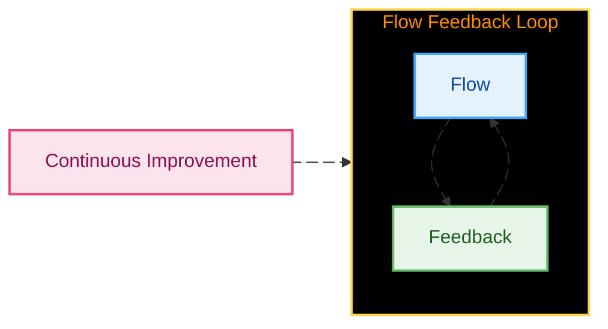
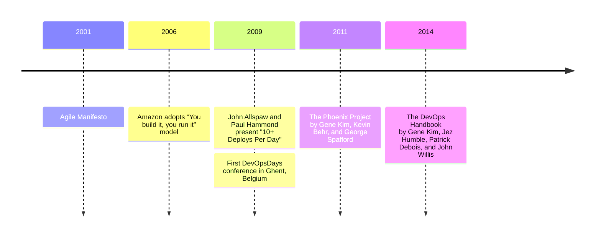
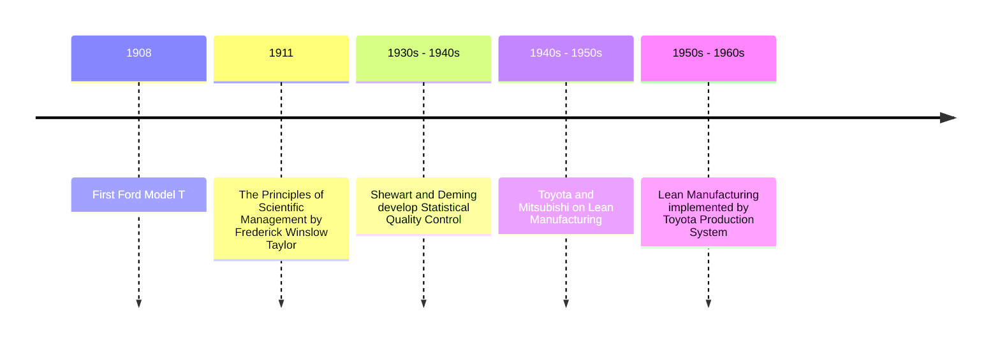

---
# You can also start simply with 'default'
theme: seriph
# random image from a curated Unsplash collection by Anthony
# like them? see https://unsplash.com/collections/94734566/slidev
background: /images/mountain-background.jpg
# some information about your slides (markdown enabled)
title: "Build, Test, and Deploy Again: A DevOps Tale"
info: |
  ## Rundown of the principles of DevOps
# apply unocss classes to the current slide
class: text-center
# https://sli.dev/features/drawing
drawings:
  persist: false
# slide transition: https://sli.dev/guide/animations.html#slide-transitions
transition: fade
# enable MDC Syntax: https://sli.dev/features/mdc
mdc: true
---

# CI/CD: Build, Test, and Deploy Again... A DevOps Tale

  One does not simply skip to the next slide. <carbon:arrow-right />

  <a href="https://github.com/robstrader/presentation-devops-cicd" target="_blank" class="slidev-icon-btn">
    <carbon:logo-github />
  </a>

<!--
The last comment block of each slide will be treated as slide notes. It will be visible and editable in Presenter Mode along with the slide. [Read more in the docs](https://sli.dev/guide/syntax.html#notes)
-->

---
transition: slide-up
layout: image-right
image: /images/ui-component-developer.jpg
---

# Who am I?

Senior Software Developer at SAS

- 👴 **Experience** - 13+ years of experience in Software Development at SAS concentrating mostly on frontend development.
  - 
<carbon:logo-react /> 6+ years in React

  - 
<carbon:workflow-automation /> 4+ years on Enterprise UI Ops Team

  - 🖥️ Frontend Application Development
  - 🖌️ UI Component Development
  - 🏗️ Application Builds
  - 🧪 Testing
  - 🔒 Security Scans
  - 🏛️ Architecture of a UI component Library/Framework

<!--
- Describe SAS some.
- Discuss my background a bit, how I became a developer.
- Transition to what we are going to build.
-->

---
transition: slide-left
layout: image-right
image: /images/cicd-end.png
backgroundSize: contain
---

# What are we building?

A simple Vite Single Page Application (SPA) with a few components, a test suite and a deployment pipeline.

- **Vite** - A modern build tool for frontend projects.
- **Vitest** - A test runner for Vite.
- **GitHub Actions** - A CI/CD tool for GitHub repositories.
- **GitHub Pages** - A free static site hosting service.

<!--
- Briefly discus each of these tools and what they do.
- Mention that these are just tools, and that they could easily be replaced with others, but the principles would remain the same.
- These are examples of how to implement CI/CD, so let's discuss what CI/CD is.
-->

---
transition: slide-down
layout: image-right
image: /images/ci.png
---

## Continuous Integration (CI)

 

- Combines code frequently to prevent "integration hell".
- Catches bugs early with automated tests.
- Saves time by automating builds and testing.
- Keeps the team aligned with the latest code.
- Ensures software is stable and ready to use.

 

<v-click>

### Practices

</v-click>

<v-clicks>

- Commit code frequently to a shared repository.
- Run automated tests on each change.
- Fix bugs as soon as they are detected.
- Keep builds fast and reliable.

</v-clicks>

<!--
- There is only one interesting version of the code.
- Changes are always visible.
- Makes code reviewing so much easier.
- Keep unfinished features unreachable or behind a feature flag.
-->

---
transition: slide-down
layout: image-right
image: /images/delivery.jpg
---

## Continuous Delivery (CD)

 

- Ensures code is ready for deployment.
- Verifies changes through automated tests.
- Reduces risk by deploying smaller, tested updates.
- Rapid delivery with high quality.
- Allows teams to release manually or automatically.

 

<v-click>

### Practices

</v-click>
<v-clicks>

- Code passes all tests before deployment.
- Use automation to deploy updates efficiently.
- Deploy smaller, incremental changes.
- Monitor deployments for issues.

</v-clicks>

<!--
- Shortens the lengths of plans. Keep plans small.
- Recover quickly from failures.
- Comes from the Agile Manifesto.
- Logical extension of CI.
- Try to disprove that the software is in a good state.
- Releasibility is the target, which makes releasing a business decision, not a technical one.
-->

---
layout: default
transition: slide-left
---

# What is DevOps?

<v-switch>
  <template v-slot:1>
    
<em>DevOps is the integration and automation of the software development and information technology operations. -Wikipedia</em>

     
    
<em>Culture, Automation, Measurement, Sharing(CAMS) -John Willis</em>

     
    
<em>A set of practices intended to reduce the time between committing a change to a system and the change being placed into normal production, while ensuring high-quality. -Len Bass, Ingo Weber & Liming Zhu</em>

     
    
<em>Optimizing the human experience and performance of software... with software... and with humans. -Andrew Clay Shafer</em>

    
  </template>

  <template v-slot:2>
  
  </template>
  <template v-slot:3>
  

  
  

  </template>
</v-switch>

---
layout: two-cols-header
---

# Principles of DevOps

::left::

- **Flow:**

  - Prioritize the flow to customers.
  - Minimize bottlenecks.

- **Feedback:**

  - Amplify feedback.
  - Shorten feedback loops.
  - Encourage collaboration.

- **Continuous Improvement:**
  - Create a culture of experimentation.
  - Learn from failures.
  - Share knowledge.

::right::

---
layout: default
---

# The History of DevOps

<!--
One gets a good rating fighting a fire. The result is visible; can be quantified. If you do it right the first time, you are invisible. You satisfied the requirements. That is your job. Mess it up, and correct it later, you become a here. - W. Edward Demin
-->

---
layout: default
---

# The History of the History of DevOps

<!--
Maybe talk about when Deming's 14 points were developed?
Plan Do Check Act
-->

---
transition: slide-down
layout: two-cols
---

## Continuous Integration (CI)

 

- Combines code frequently to prevent "integration hell."
- Catches bugs early with automated tests.
- Saves time by automating builds and testing.
- Keeps the team aligned with the latest code.
- Ensures software is stable and ready to use.

 

### Practices

- Commit code frequently to a shared repository.
- Run automated tests on each change.
- Fix bugs as soon as they are detected.
- Keep builds fast and reliable.

::right::

## Continuous Delivery (CD)

 

- Ensures code is always ready for deployment.
- Verifies every change through automated tests.
- Reduces risk by deploying smaller, tested updates.
- Speeds up delivery while keeping quality intact.
- Allows teams to release manually or automatically, as needed.

 

### Practices

- Ensure code passes all tests before deployment.
- Use automation to deploy updates efficiently.
- Deploy smaller, incremental changes.
- Monitor deployments for issues and feedback.

<!--
Context matters!

 "In theory, there is no difference between theory and practice. But, in practice, there is." - Yogi Berra
-->
